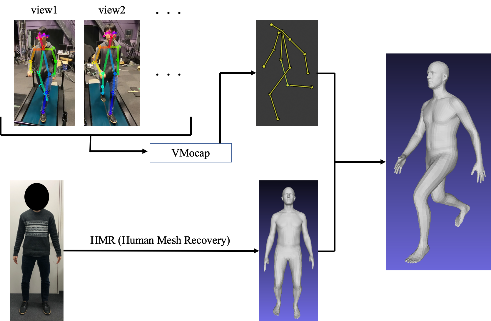

# generate the SMPL motions using vmocap
- 事前に直立姿勢で取得したメッシュモデルを，歩行時3次元の関節位置と一致するように変形させ，そのメッシュモデルをBlenderPythonAPIを用いてアニメーション化するコード
- メッシュモデルを変形させる概要図

- 実際の動画


## ファイル構造について
- . &nbsp; ：[HMR](https://github.com/akanazawa/hmr)関連のファイルが入っている（詳しくはREADME2.md）
- /exp：オリジナルファイルが入っている
  - /trc &nbsp; vmocapで取得した時系列関節3次元位置
  - /figure：HMRの出力画像
  - /imgdata：HMRに入力する画像
  - /joint：HMRのメッシュモデルの関節位置の出力
  - /objdata：HMRのメッシュモデルの出力
  - /verts：HMRのメッシュモデルの3次元の点の位置をcsv出力（ほぼobjdataと似ている）
  - /theta：HMRのメッシュモデルの体型パラメータの出力
  - /meshvol：.savebol.pyを参照
  - /poseobj：.saveobj.pyを参照
  - /poseobj-ik
  - /poseobj-ikstretch
  - /poseobj-stretch
  - /result
  - /doudemoii
  - .savevol.py /trcに基づいて,/objdataをblenderを用いて各フレームごとに変形させ体積を/meshvolに保存
  - .saveobj.py /trcに基づいて,/objdataをblenderを用いて各フレームごとに変形させたobjファイルを/poseobjに保存
  - .skinmodel.py blenderのarmature関節の設定の関数のファイル(saveob.py,savevol.pyに呼ばれる)
  - makeanim.py：今回のメインとなるコード
  - .ikbone.py armatureの関節の設定がik（makeanim.pyで呼び出す用）
  - .stretchbone.py armatureの関節の設定がstretch（makeanim.pyで呼び出す用）
  - .ikstretchbone.py armatureの関節の設定がik+stretch（makeanim.pyで呼び出す用）
  - .blender-memo.py：メモ書き

## make SMPL model from image
code from [HMR](https://github.com/akanazawa/hmr)   
imagefolder is in `./exp/imagedata/example.png`   
run with **python2**(read [HMR](https://github.com/akanazawa/hmr) settings)
```
$.
$make 0=example
```
result SMPL data is in `./exp/objdata/example.obj`

## make SMPL motions using vmocap data(.trc)
vmocapdata (.trc) is in `./exp/trc/exapmle.trc`   
SMPL data is in `./exp/objdata/example.obj`
```
$exp
{yourblenderpass} --python makeanim.py -- example.obj -- {start frame number} -- {frame range number}
```
example
```
~/../../Applications/Blender.app/Contents/MacOS/Blender --python makeanim.py -- model1.obj -- 600 -- 60
```


<!--
```
$conda activate py27
./exp/imagedata/~~.png
$make 0=~~
$cd exp
./objdata/~~~.obj
$make 0=~~~
```
結果として，./poseobjにobjファイルが入る
-->
